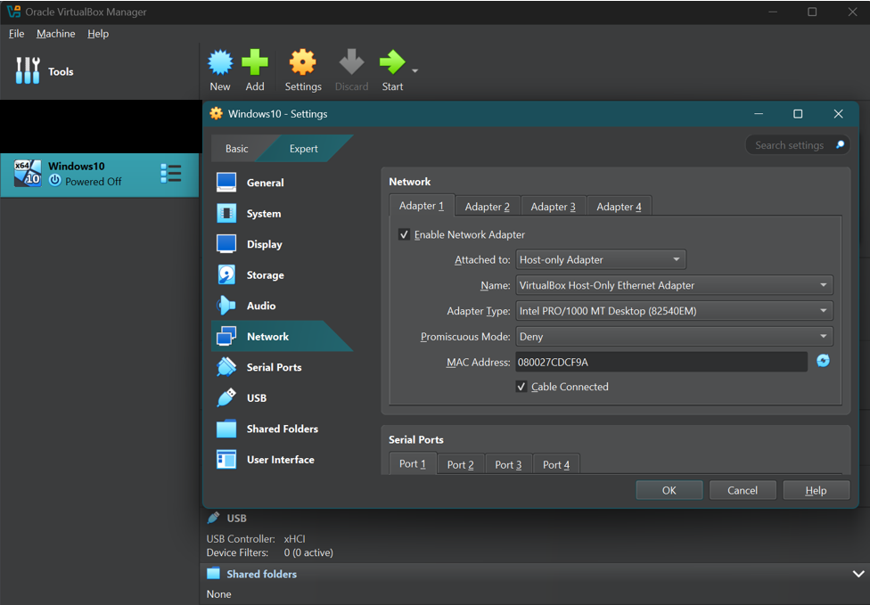
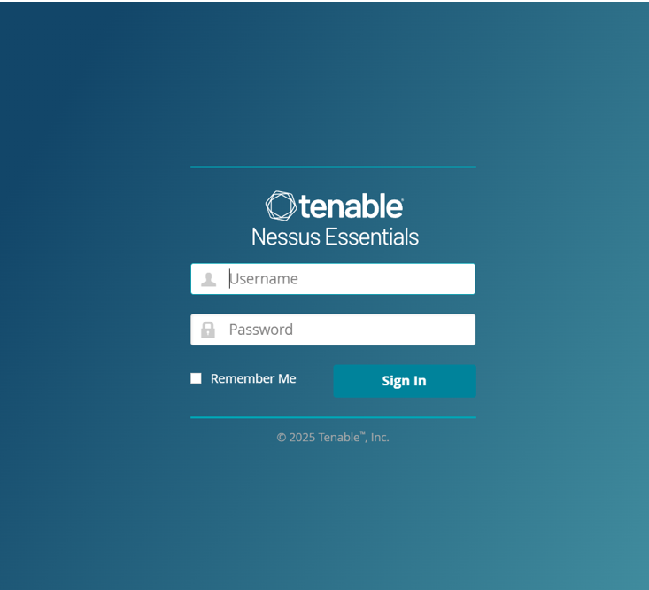
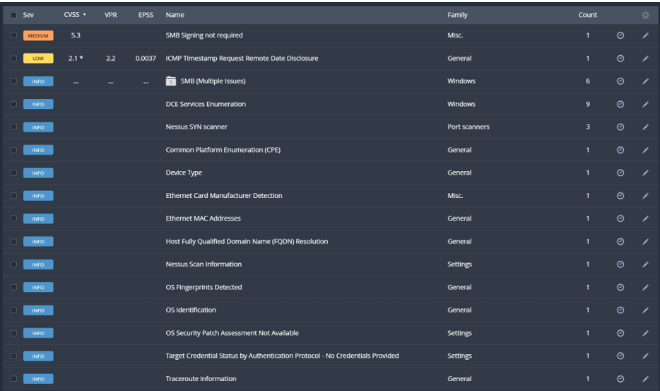
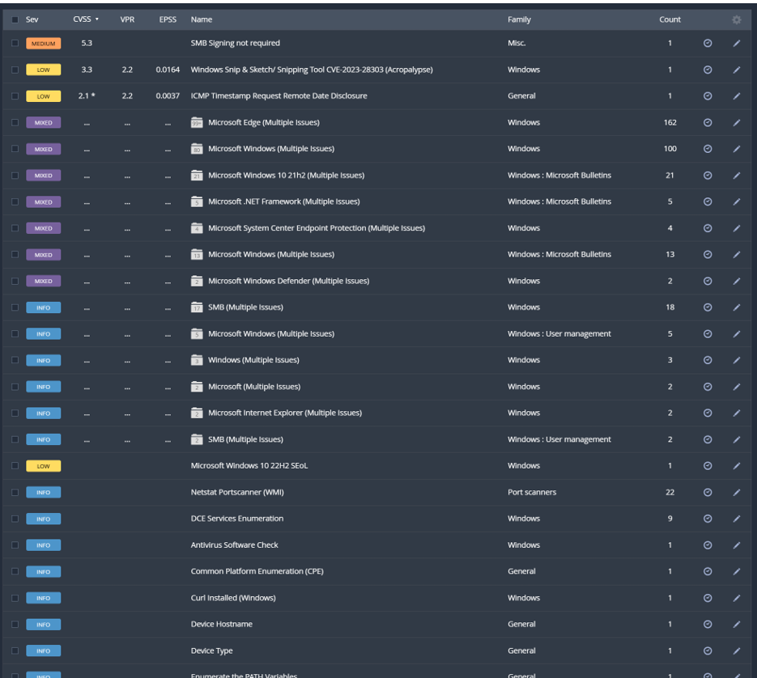
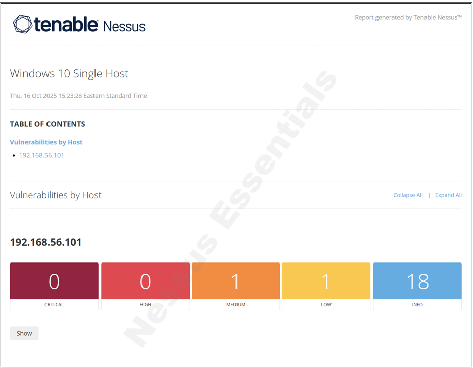
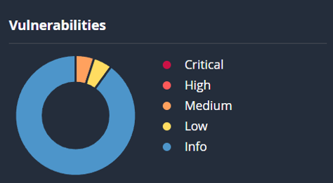
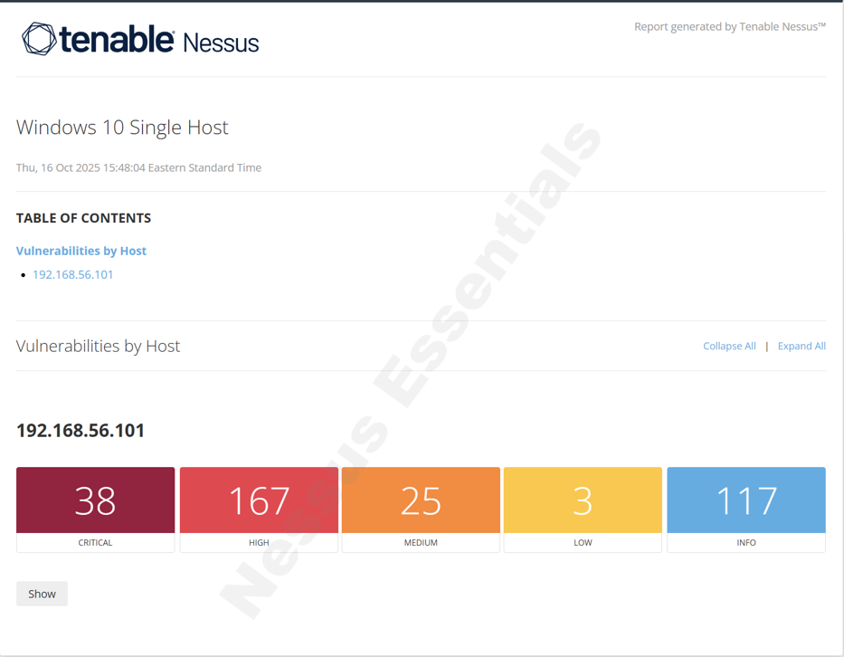
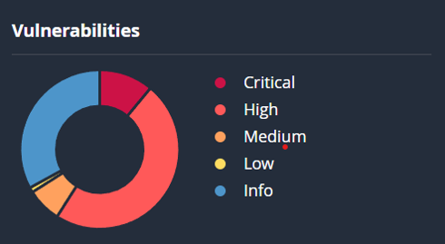

# Nessus Essentials Lab

## Overview

This project documents a vulnerability assessment performed from Nessus, running on a local host, against a single Windows 10 virtual machine configured on a Host‑Only network. The goal is to discover, analyze, and report vulnerabilities.

 

## Objectives

*	Configure Host-Only networking and a Windows 10 VM as the sole target.
*	Install and configure Nessus on your host machine.
*	Run an unauthenticated scan and a credentialed scan.
*	Analyze vulnerabilities, export evidence, and produce a remediation summary.

 

## Environment:

* **Host:** Windows 11 (Nessus running locally)
* **Target:** Windows 10 VM (IP: 192.168.56.101) 
* **Virtualization:** VirtualBox
* **Network:** Host‑Only adapter (Isolated)

 

## Quick Start

1. Configure a Host‑Only network in VirtualBox and attach the Windows 10 VM.
2. Install Nessus Essentials on your host and register/activate it.
3. Create a Basic Network Scan in Nessus targeting the VM IP.
4. Add SMB/WinRM credentials (local admin account) and run a credentialed scan.
5. Export reports (PDF / CSV), capture screenshots.

 

## **Procedures:**

### 1) Environment setup

* Create a Host‑Only network adapter in VirtualBox/VMware.
* Install or provision a Windows 10 VM and attach it to the Host‑Only adapter.
* Create a local admin account for scans (example: `labadmin` / `P@ssw0rd!`).
* Confirm VM IP with `ipconfig` (e.g., `192.168.56.101`).

### 2) Install & configure Nessus

* Install Nessus on the host and complete activation.
* Open `https://localhost:8834` and finish setup.

### 3) Run Basic Network Scan

* Create a unauthenticated scan targeting the VM IP.
* Run scan

### 4) Configure Credentials & Run Credentialed Scan

* In Nessus, add Windows credentials (SMB/WinRM) using the local admin account.
* Create a new scan that uses these credentials and run it.

### 5) Analyze Findings

* Record counts by severity (Critical / High / Medium / Low).

#### Unauthenticated Scan

#### Credentialed Scan

## Example Finding 

**Title:** SMB Signing not required

**Severity:** Medium

**Description:** Signing is not required on the remote SMB server. An unauthenticated, remote attacker can exploit this to conduct man-in-the-middle attacks against the SMB server.

**Solution:** Enforce message signing in the host's configuration. On Windows, this is found in the policy setting 'Microsoft network server: Digitally sign communications (always)'. On Samba, the setting is called 'server signing'. See the 'see also' links for further details.

## Conclusion

* In conclusion this lab provided valuable hands-on experience identifying system vulnerabilites using Nessus. By performing both unauthenicated and credentialed scanss, I gained valuable insight into the importance of vulnerability scanning and vulnerability management.
